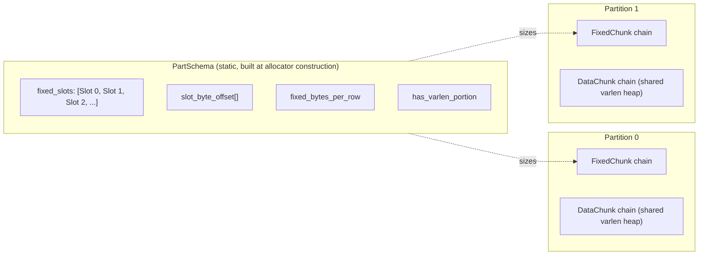

# RadixShuffle Column Primitives {#radix-shuffle-column-primitives}

`RadixShuffle` is the foundation layer for a future partitioned-hash-join (PHJ) shuffle inside ClickHouse. It provides a type-aware allocator, per-column-type scatter / reconstruct / hash primitives, and a dispatcher that resolves them from an `IDataType`. The PHJ algorithm itself — build, probe, hash table, multi-partition orchestration — is **out of scope for v1**. The performance baseline is the `phj-bench` reference: the per-row cost of each primitive must not exceed `phj-bench`'s published numbers.

For the concrete C++ types, function signatures, hash kernel internals, allocator internals, and migration checklist, see the companion [implementation notes](/development/radix-shuffle-column-primitives-implementation).

## Goal {#goal}

Ship five building blocks in `src/Common/RadixShuffle/`:

1. A type-aware **allocator** that hands writable per-partition destinations to `scatter`.
2. Per-column-type **scatter** primitives that route source rows to per-partition destinations.
3. Per-column-type **reconstruct** primitives that reassemble a target column from scattered chunks.
4. Per-column-type **hash** primitives that compute a `uint32_t` composite row hash across columns.
5. A **dispatcher** (`resolveColumnPrimitives`) that resolves the triple `(scatter, reconstruct, hash)` from a `const IDataType &`.

## Non-goals {#non-goals}

1. The full PHJ shuffle / build / probe driver.
2. PID computation or any radix-stage policy.
3. Per-batch histograms (row counts per partition) as part of the column-primitive seam — trivial; the RadixShuffle layer provides them.
4. Per-(column × partition × batch) varlen byte totals as part of the column-primitive seam — operator bookkeeping.
5. Column types beyond scope D: `ColumnVector<T>` / `ColumnDecimal<T>` / `ColumnFixedString` / `ColumnString` / `ColumnNullable(X)`. No `LowCardinality`, `Array`, `Tuple`, `Map`, `Variant`, `Dynamic`, `Object`, or `AggregateFunction`.
6. SWWC (software write-combining buffers), software prefetching, non-temporal stores — explicit non-goals in `phj-bench/README.md`.
7. NUMA awareness, multi-socket pinning, work-stealing.
8. `MemoryTracker` integration beyond what `Allocator<true>` already provides.
9. Modifying `IColumn` (no new virtual methods).

## Identifiers and widths {#identifiers-and-widths}

| Name | Type | Notes |
|------|------|-------|
| RID | `uint64_t` | Global row index within an input batch. Large enough for any realistic batch size. |
| PID | `uint16_t` | Partition identifier for the current radix stage; `P ≤ 65536` per stage. 16-bit keeps the per-row `pids[]` array half the size of a 32-bit equivalent, reducing scatter's memory footprint. |
| Hash | `uint32_t` | Per-row combined column hash. 32-bit halves the output-array size vs. 64-bit; sufficient entropy for partitioning up to `P = 65536`. |

Scatter takes `const uint16_t * pids`; hash primitives read and write `uint32_t * out`.

## Memory model {#memory-model}

Each partition `p` owns two independent chunk chains:

1. **Fixed chunk chain** — row-oriented; holds all **fixed-width arrays for all columns** in partition `p` (values, offsets, null maps) in a single contiguous buffer per chunk.
2. **Data chunk chain** — byte-oriented; one **shared varlen heap** for all varlen columns in partition `p` (string character payloads).



**Worked example** — two columns (`ColVector<UInt32>` + `ColumnString`), 256 rows landing in partition `p`:

```
Fixed chunk (partition p)          — planar, column-major
  Slot 0  UInt32 values:   256 × 4 B   =  1 024 B  (offset 0)
  Slot 1  String offsets:  256 × 8 B   =  2 048 B  (offset 1 024)
  Total fixed_bytes_per_row = 4 + 8 = 12 B (plus any alignment padding)

Data chunk (partition p)           — byte stream, shared by all varlen columns
  String char payloads for all 256 rows (total byte count known at scatter time)
```

For `Nullable(String)` the fixed chunk gains one more slot before `Offsets`:

```
  Slot 0  NullMap:         256 × 1 B   =    256 B  (offset 0)
  Slot 1  String offsets:  256 × 8 B   =  2 048 B  (offset 256, aligned to 8)
```

**Rationale.** Fixed and data regions grow independently: appending more char payloads never moves the fixed-chunk pointer, so a column primitive that cached `fixed->data` across batches can reuse it safely. When a radix stage completes, freeing partition `p`'s memory requires dropping only two chunk chains. The per-partition model also avoids the per-(column × partition) chain explosion that would occur with the old design at high `K × P`.

## Static schema {#static-schema}

Allocation layout is **static**, determined once at allocator construction. Batch code supplies only dynamic row counts and aggregate varlen byte totals; the allocator derives all buffer sizes from the schema.

A `PartSchema` carries:

- A list of **fixed slots**, one per array that lands in the fixed chunk. Each slot records the originating column index, its role (`Values`, `Offsets`, `NullMap`, or `FixedStringChars`), element size, and alignment.
- A parallel list of **byte offsets** — for slot `s`, `slot_byte_offset[s]` is the byte offset of slot `s`'s array from the start of the fixed chunk's data region at row 0.
- **`fixed_bytes_per_row`** — the stride in bytes between row `r` and row `r+1` across all slots (sum of per-slot element sizes plus inter-slot alignment padding).
- **`has_varlen_portion`** — true if at least one column in the schema contributes to the data chunk.

**Type-to-slot mapping:**

| Column type | Fixed slots (in order) | Data chunk? |
|---|---|---|
| `UInt32` (or any `ColumnVector<T>`) | `Values` (4 B) | no |
| `String` | `Offsets` (8 B) | yes |
| `Nullable(String)` | `NullMap` (1 B), `Offsets` (8 B) | yes |
| `Nullable(UInt32)` | `NullMap` (1 B), `Values` (4 B) | no |
| `FixedString(n)` | `FixedStringChars` (`n` B) | no |

**Planar (column-major) address formula.** Given slot index `s` and row index `r` (0-based within the chunk), the byte address of that element is:

```
addr(s, r) = slot_byte_offset[s] + r × element_size[s]
```

`fixed_bytes_per_row` is used only for chunk sizing (determining how many rows fit in a fixed chunk of a given byte budget); it does not appear in the per-element address formula.

## Column primitives {#column-primitives}

A column primitive is a triple `(scatter, reconstruct, hash)` bound to a specific column type. Beyond the function pointers it carries:

- **`fixed_slot_indices`** — indices into `PartSchema::fixed_slots` identifying which slots this primitive reads/writes. For example, a `String` primitive owns the `Offsets` slot; a `Nullable(String)` primitive owns the `NullMap` and `Offsets` slots.
- **`writes_varlen`** — true if the primitive appends bytes to the data chunk.
- **`nested`** — for `Nullable(X)`, a shared pointer to the column primitive for `X`. `Nullable` scatter writes the `NullMap` slot and then delegates to the nested primitive for the rest.

The dispatcher `resolveColumnPrimitives` takes a `const IDataType &` and returns the correctly bound `ColumnPrimitives` value. It throws a `LOGICAL_ERROR` exception for unsupported types. Column primitives should be rebuilt per shuffle pass (not cached across type changes).

## Allocator {#allocator}

### Construction {#allocator-construction}

The allocator is constructed with a `PartSchema`, a partition count `P`, an expected-total-rows hint (used to size initial chunks to match average per-partition contribution), and tunable options. **Construction must not allocate any chunks** — it only derives per-partition sizing parameters from the schema.

### Handle acquire / release {#allocator-handle}

A producer thread acquires a `Handle` from the allocator on the cold path (synchronization is permitted). A thread holds at most one handle at a time; handles are not transferable across threads. Releasing a handle finalizes its allocations: no further reservations may occur through it, but all its written chunks remain readable until the allocator is destroyed.

### Per-batch reserve {#allocator-reserve}

The hot-path entry point is `reserve`. Its inputs are SOA arrays over partitions:

- `rows[p]` — number of rows the caller wants to scatter into partition `p` this batch.
- `varlen_bytes[p]` — total byte payload for all varlen columns in partition `p` this batch (with alignment padding already applied by the caller).

There is no `col_idx` argument: because the schema is static, all per-column sizing is implicit.

For each partition `p`, the allocator returns a `PartReserveGrant` containing:

- `granted_rows` — actual rows reserved (≤ `rows[p]`).
- `granted_varlen_bytes` — actual varlen bytes reserved (≤ `varlen_bytes[p]`).
- `slice` — a `PartReservation` carrying:
  - `fixed` + `begin_row` + `reserved_rows`: the carved row range within the partition's current fixed chunk.
  - `data` + `begin_byte` + `reserved_bytes`: the carved byte range within the partition's current data chunk (`data` is null for fixed-only partitions).
- `fully_satisfied` — true iff `granted_rows == rows[p]` and `granted_varlen_bytes == varlen_bytes[p]`.

Reservation is the commit: cursors advance atomically with the call; the reserved space is considered spent from the allocator's accounting perspective even if the caller under-fills it.

### Partial grants {#allocator-partial-grants}

The allocator may grant fewer rows or bytes than requested (for example, when the current chunk's remaining capacity is smaller than the request). The caller is responsible for handling partial grants, typically by retrying the unsatisfied remainder.

### Stale-pointer bitset {#allocator-stale-bitset}

Each `reserve` call returns one bitset covering all `P` partitions. Bit `p` is set if and only if partition `p`'s `FixedChunk` was **newly allocated** during this call (the old tail was exhausted and a fresh chunk was appended). Data-chunk pointers are always re-read fresh from `PartReservation.data` per batch; callers must not cache them across batches. Fixed-chunk pointers, by contrast, are stable across batches when the corresponding bit is clear; callers may cache them to avoid reloading from the grant struct on every batch.

### Behavioral constraints {#allocator-constraints}

1. **Hot-path synchronization rule.** The reservation path must not block on any cross-thread synchronization primitive, and its per-call latency must not grow with the number of concurrent contending threads.
2. **Waste bound (continuous).** At all times during the allocator's lifetime, without any separate compaction step: `total_allocated_bytes ≤ active_partitions × (MIN_FIXED_FLOOR_BYTES + MIN_DATA_FLOOR_BYTES) + 1.10 × total_reserved_bytes`, where `active_partitions` is the number of partitions that have at least one fixed or data chunk, and the floor terms apply once per active partition (only for the chunk types that are actually present).
3. **Minimum chunk size.** Each newly allocated fixed chunk must accommodate at least `MIN_CHUNK_FLOOR_ROWS` rows, and each newly allocated data chunk at least `MIN_CHUNK_FLOOR_BYTES` of payload, to amortize per-chunk overhead. A trailing chunk (the final chunk in a chain) may be smaller.

Destruction frees all memory in a single act. There is no per-chunk or per-handle deallocation during the allocator's lifetime.

## Scatter {#scatter}

Scatter takes a source column of `n` rows, a per-row partition assignment `pids[]` (`uint16_t`, each value in `[0, P)`), per-partition writable destinations, a mutable `ScatterState` carrying the write-pointer cache, and the stale-pointer bitset returned by the same `reserve` call.

Scatter appends, in source order, the rows belonging to partition `p` into `dst[p]`'s fixed-slot regions and, for varlen column types, into `dst[p].data->bytes + dst[p].begin_byte`.

### ScatterState {#scatter-state}

`ScatterState` is a per-thread, per-column mutable struct that caches the write pointer for each partition, eliminating the O(P) per-batch pointer setup in steady state.

The cache is populated on the **first call** (all P pointers are initialised from `dst`) and selectively refreshed on subsequent calls:

- **Fixed-slot pointers** are refreshed only for partitions whose bit is set in `stale_fixed_bitset`. A bit is set when `reserve` allocated a new `FixedChunk` for that partition; otherwise the cached pointer already points to the next free row in the same chunk.
- **Data-chunk pointers** (varlen columns only) are refreshed when `dst[p].data` differs from the cached `DataChunk *` pointer. When the `DataChunk` has not changed, the cached pointer already points to the next free byte in the chunk, because the allocator advances its cursor by exactly the bytes written in the previous batch.

For `Nullable(X)`, the outer `ScatterState` caches the `NullMap` write pointer; a nested `ScatterState` (lazily created on first call) handles `X`'s slots.

`ScatterState` is not thread-safe; each producer thread owns one instance per column for the duration of its `Handle` ownership.

**Pre-conditions (caller's responsibility):**

- `pids[j] < P` for all `j ∈ [0, n)`.
- Each destination `dst[p]` has been reserved (via `reserve`) with sufficient rows and varlen bytes to hold all rows where `pids[j] == p`.
- `stale_fixed_bitset` is the array returned by the immediately preceding `reserve` call for this batch; it must not be reused across batches.
- The source column's concrete type matches the resolved `ColumnPrimitives`.
- `state` was constructed with the same `P` as `partitions`.

**Post-conditions (primitive's guarantee):**

- For every partition `p`, the fixed-slot arrays contain, appended after any prior content, every row `j` with `pids[j] == p`, in ascending `j` order.
- Total rows appended across all partitions equals `n`. The source column is unchanged.
- `state` holds valid write pointers for all partitions after the call; they are ready for the next batch without further initialisation (unless `reserve` sets stale bits).
- Scatter must not allocate.

## Reconstruct {#reconstruct}

Reconstruct takes an ordered list of per-partition **view tuples** and appends rows from them into a pre-allocated target column, stopping at the target's capacity boundary. Each view references a `FixedChunk` with a half-open row range `[row_begin, row_end)` and, for varlen primitives, a `DataChunk` with a byte range `[byte_begin, byte_end)`. For fixed-only primitives the data fields are unused.

The caller drives reconstruct as a **pump**: pre-allocate target capacity, call reconstruct, observe the returned `ResumePosition`, optionally extend the target and call again with the returned position as the new start. Assembling a partition across multiple calls produces the same result as a single sufficiently-large call.

**Pre-conditions (caller's responsibility):**

- Target column has been pre-allocated to the desired row capacity (and, for varlen types, char-buffer capacity sufficient for the data being reconstructed).
- For `Nullable(X)`: null-map row capacity ≥ nested column row capacity. This is a pure caller pre-condition; reconstruct does not check it at runtime.
- Each view's row and byte ranges cover exactly what `scatter` wrote; ranges are correct by the caller's bookkeeping.

**Post-conditions (primitive's guarantee):**

- Rows are appended into the target up to but not exceeding its pre-allocated capacity (rows AND, for varlen types, bytes). The stop boundary reached first governs.
- Target capacity is unchanged.
- Input views and their underlying chunks are unchanged.
- Returned `ResumePosition` identifies the first unconsumed row across the view list. When the list is exhausted, the position is the end sentinel.
- Reconstruct must not allocate.

## Hash {#hash}

Hash takes a source column of `n` rows and a caller-allocated `uint32_t * out` array of at least `n` entries. It updates the array in-place: for every `i ∈ [0, n)`,

```
out[i] = hashCombine(prior_out[i], h(src[i]))
```

where `h(.)` is the primitive's per-row hash for this column type.

**`hashCombine` is uniform across every primitive resolved by the dispatcher**, defined exactly as:

```
combine(prior, h) = prior ^ (h + 0x9e3779b9 + (prior << 6) + (prior >> 2))
```

The constant `0x9e3779b9` is the 32-bit fractional part of the golden ratio (phi). The `(prior << 6) + (prior >> 2)` terms inject bits from across `prior` into the XOR, mitigating cancellation when `prior == h`. This is the canonical 32-bit `boost::hash_combine` form.

Because the combiner is uniform, callers may chain `hash` calls across multiple columns — in any fixed order — to compute a deterministic composite per-row key. Reordering columns changes the composite hash by the well-defined combiner rule.

**`Nullable(X)` composition.** The null byte for each row participates in `h(.)`, so two rows with identical nested-column bytes but different null states produce different hash outputs.

**Pre-conditions (caller's responsibility):**

- `out` is pre-allocated with at least `n` entries.
- `out` is pre-initialized to the desired starting value (zero for a fresh hash; the result of a prior `hash` call for accumulation across columns).
- Source column's concrete type matches the resolved `ColumnPrimitives`.

**Post-conditions (primitive's guarantee):**

- For every `i`, `out[i]` equals `hashCombine(prior_out[i], h(src[i]))`.
- Source column is unchanged.
- Hash must not allocate.

## Round-trip invariant {#round-trip}

For any supported column type and any partition assignment `pids[]`:

```
source → scatter → (per partition: reconstruct repeatedly until input list exhausted)
       → concatenate partitions in PID order
```

yields a column whose **multiset** of rows equals the source's multiset of rows. The output's row order depends on the caller's chosen view-list order; this spec does not require it to match the source order.

**`Nullable(X)`.** For `Nullable(X)`, the round-trip preserves both the null map and the nested column's content byte-for-byte. Scatter and reconstruct treat `ColumnNullable` as two parallel sub-columns subject to the round-trip invariant independently. The nested column's bytes at null positions are preserved — not normalized, not stripped, not defaulted.

## Performance contract {#performance-contract}

Column primitives are always called in batches. The benchmark (`bench_radix_shuffle_column_primitives`) measures, over a configurable workload, the per-row cost of each primitive.

**Required workload sweep:**

| Parameter | Values |
|-----------|--------|
| Batch size | `{1024, 4096, 16384}` rows |
| P (partitions) | `{4, 8, 16, 32, 64, 128, 256}` |
| K (columns) | `{1, 2, 4, 8}` |
| T (threads) | `{1, 4, 8, 16, 32, 48}` |

**Reported numbers** per (column type, workload configuration):

- **ns/row** for `scatter` (median over the configured batches).
- **Total bandwidth** across all threads (rows/sec = threads × per-thread rows/sec).

There is no statistical gating; the benchmark is a measurement tool, not a pass/fail gate. `phj-bench`'s published numbers are a manual reference baseline for engineers.

## Acceptance criteria {#acceptance-criteria}

- Round-trip identity holds for every supported column type.
- Reconstruct's returned `ResumePosition` correctly resumes when used as the start of a subsequent call on the same view list; assembling across multiple bounded calls is byte-equivalent to a single sufficiently-allocated call.
- `hashCombine` uniformity: composing `hash` calls across columns in any fixed order is deterministic; reordering columns changes the composite hash by the well-defined combiner rule.
- `scatter`, `reconstruct`, and `hash` do not allocate.
- Waste bound holds continuously throughout the allocator's lifetime (not only at end-of-phase); verified at multiple intermediate points during the allocator's lifetime.
- Per-partition fixed meaningful-rows floor holds for every fixed chunk except the trailing chunk of each partition's chain.
- Per-partition data meaningful-bytes floor holds for every data chunk except the trailing chunk.
- Hot-path synchronization rule: no blocking primitives on reservation; per-call latency does not scale with the number of concurrent contending threads.
- All `clang-tidy` warnings and errors in newly added files are fixed.
- All newly added files compile under ClickHouse's existing warning set with `-Werror`.
- Tests pass under both `-O3` (release) and ASan builds.
- Build succeeds via the standard ClickHouse build flow.
- Benchmark prints a stdout summary by default (per workload configuration and per type: achieved ns/row and total bandwidth). CSV output is supported via an opt-in CLI flag and is disabled by default.

## See also {#see-also}

- [RadixShuffle Column Primitives — Implementation Notes](/development/radix-shuffle-column-primitives-implementation) — concrete C++ struct definitions, function typedefs, hash kernel internals (`fmix32`, `hashCombine` C++ code, SIMD multi-versioning), allocator internals, and the migration checklist.
