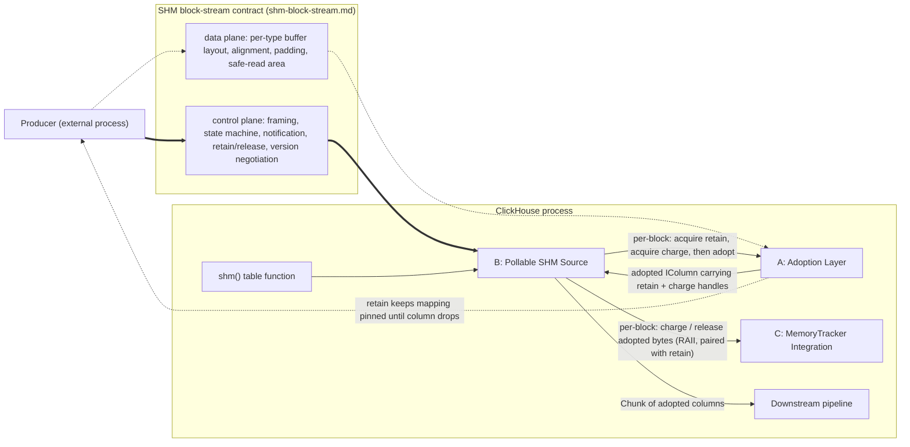

# Zero-Copy SHM Source — System Spec

This is a contract. It binds the deliverable; it does not prescribe an implementation.

This file is the parent spec for the zero-copy SHM source feature. It owns the system-wide mission, glossary, non-goals, cross-component invariants, and end-to-end acceptance criteria. The boundary contract between any conforming external producer and the ClickHouse consumer lives in [shm-block-stream spec](./shm-block-stream-spec.md). Per-component contracts live in [adoption-layer spec](./shm-adoption-layer-spec.md), [pollable-shm-source spec](./shm-pollable-source-spec.md), and [memory-tracker-integration spec](./shm-memory-tracker-spec.md).

## Mission

Let a ClickHouse query pull rows from a foreign-memory producer that publishes blocks via SHM, without copying column data into ClickHouse-owned buffers, while the executor waits on the producer through the standard async/poll path, and while the bytes the consumer is holding are visible to the standard memory accounting and limits. Within each emitted chunk, rows are in producer-buffer order for that block; the order in which chunks are emitted across blocks is unspecified.

Three sub-deliverables. The positive data path is proved end-to-end by one deterministic random-data query; poll, cancellation, memory-limit, producer-misbehavior, and leak properties are proved by targeted tests in the same suite.

* **(a) Zero-copy column adoption from foreign memory.** A column-construction surface that wraps an externally-owned, pre-padded byte buffer as an `IColumn` with defined retain semantics. Detailed contract: [adoption-layer spec — Mission](./shm-adoption-layer-spec.md#mission).
* **(b) Pollable SHM source.** A new source that consumes producer-published SHM blocks, integrates with the executor's async/poll path, and emits `Chunk`s composed of adopted columns from (a). The source is reached from SQL via a new table function. Detailed contract: [pollable-shm-source spec — Mission](./shm-pollable-source-spec.md#mission).
* **(c) MemoryTracker integration.** SHM bytes the consumer holds are visible to ClickHouse's memory accounting and limits. Detailed contract: [memory-tracker-integration spec — Mission](./shm-memory-tracker-spec.md#mission).

The interface between any conforming external producer and the ClickHouse consumer is itself a contract — distinct from these three sub-deliverables and satisfied by both sides. The producer side is satisfied by whatever external process publishes blocks; the consumer side is satisfied jointly by (a) and (b). The wire contract lives in [shm-block-stream spec — Mission](./shm-block-stream-spec.md#mission).

## Component map



Thick edges are control-plane traffic; dashed edges are the data plane. The two are deliberately separated so that no consumer-side code path reads data-plane bytes for a block until the control plane has published that block.

**Producer ⇒ control plane.** The producer is the only writer of the control plane. It drives block framing, the publication state machine, version handshake, retain/release responses, and end-of-stream signalling. Every consumer-side decision about which bytes are readable comes from this channel.

**Producer ⇢ data plane.** The producer also writes payload bytes into the data plane — buffers laid out per the per-type rules in the wire contract. The producer does not "send" payload to the consumer; payload becomes readable when, and only when, the corresponding control-plane state transition is observed.

**Control plane ⇒ Pollable SHM Source.** The pollable source is the only consumer-side reader of the control plane. It tracks block readiness, reads each block's declared layout, recognises end-of-stream, and observes retain refcounts settle.

**Data plane ⇢ Adoption Layer.** The data plane is the byte source the adoption layer wraps. The source does not read payload bytes directly — it routes each block's declared byte ranges to the adoption layer, which is the only consumer-side party that turns those bytes into `IColumn`s.

**`shm()` table function → Source.** The SQL entry point. A query that references the `shm()` table function instantiates the pollable source for that query; lifecycle of the source is the lifecycle of that query operator.

**Source → Adoption Layer (per-block: acquire retain, acquire charge, then adopt).** For each published block the source first acquires the wire retain token (pinning the producer region), then acquires a charge handle from the memory-tracker-integration charge entry, then hands the adoption layer the producer-declared layout (buffer pointers, sizes, padding, sentinel-byte status), the retain token, and the charge handle, requesting construction of one `IColumn` per declared column.

**Adoption Layer → Source (adopted `IColumn` carrying retain + charge handles).** The adoption layer returns adopted columns carrying both the retain token and the charge handle as their lifetime handles. As long as any column (or derived handle) from the block is live, both the producer-side region and the memory charge remain active.

**Pollable SHM Source → MemoryTracker Integration (per-block: charge / release adopted bytes (RAII, paired with retain)).** Immediately after each per-block retain acquisition, the source charges the block's adopted byte count into the active query-level MemoryTracker. The charge handle is passed into `adopt()` alongside the retain token and carried through the adopted columns' lifetime. On final drop of adopted state, both the retain and the charge handle are released together. The charge/release pair is therefore RAII-scoped to the retain token's lifetime.

**Source → downstream pipeline (Chunk of adopted columns).** The source assembles adopted columns into a `Chunk` and emits it. Downstream operators consume the `Chunk` without distinguishing it from a copy-owned chunk; per [adoption-layer spec — I1 Observability for supported read paths](./shm-adoption-layer-spec.md#invariants), an adopted column is indistinguishable from a copy-owned one across the read paths exercised by the test query.

**Adoption Layer ⇢ Producer (retain keeps mapping pinned until column drops).** The retain token is the sequencing primitive that keeps producer-side region reuse — republish, truncate, unmap-remap — behind consumer-side reads. The producer-facing rules for this are [shm-block-stream spec — AC10 Retain integrity under producer reuse](./shm-block-stream-spec.md#acceptance-criteria).

## Glossary

| Term | Meaning in this contract |
|---|---|
| **SHM** | A region of memory mapped into the ClickHouse process address space that was not allocated by ClickHouse's allocator. |
| **Producer** | The external party (process or test harness) that writes blocks of column data into SHM and signals their availability. |
| **Consumer** | The ClickHouse query-pipeline source under construction. |
| **Adoption** | Constructing an `IColumn` whose primary byte buffer points at producer memory, with no `memcpy` of column payload. |
| **Retain** | A reference-counted token carried by adopted state that keeps a producer-side region pinned for as long as ClickHouse references it. |
| **Column-storage contract** | ClickHouse's existing padding, alignment, and sentinel-byte requirements for the byte buffers backing `IColumn`s. |
| **Pollable source** | An `IProcessor` that participates in the standard async/poll path of the ClickHouse query executor. |
| **MemoryTracker chain** | The per-query → per-user → global tree of memory trackers ClickHouse maintains for accounting and limit enforcement. |
| **SHM-adoption ABI** | The versioned ABI introduced by this feature for producer-published buffers. Specifies per supported type the layout, alignment, padding, safe-read area, offset encoding, byte order, metadata, notification, retain/release, and failure semantics. Also specifies the producer/consumer synchronization contract: publication state machine, acquire/release ordering, visibility of payload writes before metadata publication, readiness notification ordering, and rules for region reuse after release. Distinct from ClickHouse's internal column-storage implementation. |
| **Adopted byte count** | The byte ranges retained by ClickHouse and reachable through adopted `IColumn` state. For each AC2 type, the adopted byte count covers the data buffers declared per the per-type buffer layout in [shm-block-stream spec — Wire interfaces](./shm-block-stream-spec.md#wire-interfaces), including required safe-read padding as defined by ClickHouse's column-storage contract (`PaddedPODArray<T>` contract). Control-plane metadata — the handshake region and per-block metadata — is *not* charged: it is small, fixed in size, untouched after attach and per-block publication respectively, and not part of the per-block working set that MemoryTracker limits should bound. Each byte range is charged exactly once on retain acquisition (refcount 0 to 1) and released exactly once on retain refcount return to zero. The implementation reports both logical payload bytes (data without padding) and charged adopted bytes (with padding) for observability. |
| **Trust model** | Phase 1 assumes a local, non-malicious producer that conforms to the wire's [retain/release contract](./shm-block-stream-spec.md#wire-interfaces) — in particular, it does not truncate, unmap, or otherwise invalidate a backing region while consumer retains against that region are live. The consumer handles malformed metadata, bad layout declarations, premature stream termination (before end-of-stream), producer crash, and stall (bounded by [pollable-shm-source spec — I12 Stall is bounded](./shm-pollable-source-spec.md#invariants)), all surfaced as typed exceptions through the control plane. Consumer-side robustness against retain-protocol violation by the producer (e.g. truncation under live retain) is out of scope; the wire's chosen SHM primitive is not required to be malicious-producer-proof. The retain protocol bounds that risk by contract. |

## Non-goals

Explicitly out of scope. If a later task requires any of these, the contract is renegotiated first.

**N1.** No cross-host SHM. This is shared memory within one host.

**N2.** No ClickHouse-writes-to-SHM. The flow is producer → ClickHouse only.

**N3.** No general-purpose IPC framework. One source type, one direction.

**N4.** No multi-consumer fan-out of a single block.

**N5.** No replacement or refactor of existing copy-based ingestion paths (Arrow, Native, MergeTree readers, etc.). This contract introduces an additional fast path; it does not displace existing ones.

**N6.** No production-quality access control / sandboxing of SHM resources.

**N7.** No coverage of every `IColumn` kind in phase 1. The supported set is fixed in AC2; any other type is rejected with a typed exception — at SQL parse/resolve time and at handshake cross-validation. (AC2 lives in [adoption-layer spec — Acceptance criteria](./shm-adoption-layer-spec.md#acceptance-criteria).)

**N8.** No operator changes outside the new source. Existing downstream operators are not modified for phase 1. For AC1's query path, adopted columns must be consumable by the existing pipeline without semantic differences from copy-owned columns (per I1, owned in [adoption-layer spec — Invariants](./shm-adoption-layer-spec.md#invariants)). This contract does *not* require zero-copy preservation through every possible downstream operator or query shape; an operator that legitimately materializes derived state (e.g. building aggregation tables) is unaffected by this contract.

**N9.** No format compatibility with any external standard (Arrow IPC, Flatbuffers, Protobuf). The producer/consumer wire format is private to this work.

**N10.** No cross-platform support. Linux only.

**N11.** No multi-stream parallelism inside the source in phase 1. The source exposes a single stream; downstream pipelining decides parallelism.

**N12.** No global row-order promise. Rows within a single emitted chunk preserve producer-buffer order for that block; the order in which chunks are emitted across blocks is unspecified. AC1 uses only order-invariant aggregations and does not test row sequence.

## Cross-component invariants

These invariants are owned at the system level because their surface area spans more than one component. Properties that hold for every implementation choice consistent with this contract.

**I5. Retain correctness.** A producer-side SHM region is pinned for the lifetime of every ClickHouse object that references its bytes. There is no path that releases producer memory while a live `IColumn` (or any derived handle) still references it. Writes from ClickHouse always happen against ClickHouse-owned memory.

I5 surface area:

- [adoption-layer spec — Interfaces & contracts](./shm-adoption-layer-spec.md#interfaces--contracts) — *owns the retain-token protocol carried by every adopted column*
- [pollable-shm-source spec — Interfaces & contracts](./shm-pollable-source-spec.md#interfaces--contracts) — *owns consumer-side block-reuse sequencing*
- [shm-block-stream spec — Acceptance criteria](./shm-block-stream-spec.md#acceptance-criteria) — *AC10 pins the producer-side reuse contract this invariant relies on*

**I10. Exception safety.** An exception raised during block ingestion leaves the MemoryTracker and the producer-retain state equivalent to "before the offending block was touched." No leaked bytes, no leaked retains, no leaked fds.

I10 surface area:

- [memory-tracker-integration spec — Invariants](./shm-memory-tracker-spec.md#invariants) — *owns adopted-byte charge/release exactness across exception paths*
- [adoption-layer spec — Invariants](./shm-adoption-layer-spec.md#invariants) — *owns producer-retain state across adoption failures*
- [pollable-shm-source spec — Invariants](./shm-pollable-source-spec.md#invariants) — *owns fd lifetime across exception paths*

Component-local and wire-level invariants — full text in the spec named in each link:

- [adoption-layer spec — I1 Observability for supported read paths](./shm-adoption-layer-spec.md#invariants) — *an adopted column behaves as a copy-owned column on AC1's read paths*
- [shm-block-stream spec — I2 Producer satisfies the SHM-adoption ABI](./shm-block-stream-spec.md#invariants) — *the producer-facing existence statement for the SHM-adoption ABI*
- [adoption-layer spec — I3 Adopted memory is immutable from ClickHouse](./shm-adoption-layer-spec.md#invariants) — *no ClickHouse code path writes to producer memory*
- [adoption-layer spec — I4 Malformed supported buffers fail loudly](./shm-adoption-layer-spec.md#invariants) — *adoption rejects ABI violations before any unsafe read*
- [pollable-shm-source spec — I6 Pollable contract](./shm-pollable-source-spec.md#invariants) — *source satisfies the executor's async/poll-processor contract*
- [memory-tracker-integration spec — I7 Adopted-byte accounting is exact at the feature boundary](./shm-memory-tracker-spec.md#invariants) — *RAII counter is exact; tracker-chain reflection is within slack*
- [memory-tracker-integration spec — I8 Memory limits are enforced](./shm-memory-tracker-spec.md#invariants) — *adoption exceeding an active limit fails cleanly*
- [pollable-shm-source spec — I9 Cancellation is bounded](./shm-pollable-source-spec.md#invariants) — *cancellation reclaims SHM in bounded time regardless of producer state*
- [shm-block-stream spec — I11 Producer death is detected through the control plane](./shm-block-stream-spec.md#invariants) — *retained mappings stay address-valid; producer death is observed without faulting*

## End-to-end acceptance criteria

End-to-end checks live at the system level because they span every component plus the wire.

**Row-order contract.** Rows within each emitted chunk are in producer-buffer order for that block. The order in which chunks are emitted across blocks is unspecified; downstream operators must not rely on any global row order. AC1's aggregations are deliberately order-invariant so that the bit-identical-output check holds regardless of block emission order. Per [N12](#non-goals), cross-block ordering is unspecified and is not tested.

**AC1. Functional correctness.** The test schema is

```sql
(id UInt64, v1 UInt64, v2 UInt64, s1 String, s2 String)
```

with `s1` random length in `[0, 31]` bytes and `s2` random length in `[0, 255]` bytes. The producer generates `N` rows from a fixed seed; `id` is a sequential row index, the other columns are random. The test query is

```sql
SELECT
    count(),
    sum(id),
    sum(v1),
    sum(v2),
    sum(cityHash64(s1)),
    sum(cityHash64(s2)),
    sum(length(s1)),
    sum(length(s2))
FROM shm(…)
```

run through the new table function. Every output value must be bit-identical to the same query run against the same generated rows ingested via a reference path (e.g. `Values` or `Native`).

**AC7. Safety / leak audit.** Passes ASan + LSan. Repeated execution (≥1000 iterations in one process) shows stable fd count and stable SHM segment count.

Component- and wire-level acceptance criteria — full text in the spec named in each link:

- [adoption-layer spec — AC2 Type coverage](./shm-adoption-layer-spec.md#acceptance-criteria) — *which `IColumn` kinds AC1 exercises end-to-end through adoption*
- [adoption-layer spec — AC3 Adoption proof](./shm-adoption-layer-spec.md#acceptance-criteria) — *pointer-identity check that AC1's emitted chunks are actually adopted*
- [pollable-shm-source spec — AC4 Pollable wiring works](./shm-pollable-source-spec.md#acceptance-criteria) — *AC1 under varying thread counts plus cancellation*
- [memory-tracker-integration spec — AC5 MemoryTracker correctness](./shm-memory-tracker-spec.md#acceptance-criteria) — *peaks, baselines, and limit-failure behavior across AC1 and a constrained variant*
- [pollable-shm-source spec — AC6 Producer-misbehavior coverage](./shm-pollable-source-spec.md#acceptance-criteria) — *typed-exception coverage across malformed / crashing / mid-stream producers*
- [shm-block-stream spec — AC8 Producer ABI documented in-tree](./shm-block-stream-spec.md#acceptance-criteria) — *in-tree doc sufficient for an external producer to be implemented*
- [pollable-shm-source spec — AC9 Feature gate](./shm-pollable-source-spec.md#acceptance-criteria) — *experimental setting gating the new table function*
- [shm-block-stream spec — AC10 Retain integrity under producer reuse](./shm-block-stream-spec.md#acceptance-criteria) — *retain protocol withstands republish / truncate / unmap-remap*

## System-level stop conditions

Halt and re-open this contract — do not silently work around — if any of the following becomes true. No new SCs live at the system level; each is owned by the spec whose detection surface defines it.

- [adoption-layer spec — S1 Invasive ClickHouse changes](./shm-adoption-layer-spec.md#stop-conditions) — *halts if the adopt seam stops being localized*
- [pollable-shm-source spec — S2 IProcessor / executor contract modification required](./shm-pollable-source-spec.md#stop-conditions) — *halts if the source must change the executor's contract instead of implementing against it*
- [memory-tracker-integration spec — S3 Adopted-byte exactness or tracker propagation infeasible](./shm-memory-tracker-spec.md#stop-conditions) — *halts if RAII exactness or tracker-chain propagation slack cannot be met*
- [pollable-shm-source spec — S4 Cancellation unbounded](./shm-pollable-source-spec.md#stop-conditions) — *halts if I9 is unachievable under any reproducible sequence*
- [pollable-shm-source spec — S5 Producer-side preconditions not finite/bounded](./shm-pollable-source-spec.md#stop-conditions) — *halts if the set of detectable producer violations is unbounded*
- [adoption-layer spec — S6 Zero adoption on AC1 query](./shm-adoption-layer-spec.md#stop-conditions) — *halts if phase 1 lands with zero adoption on the test query*
- [adoption-layer spec — S7 Test query reaches IColumn behavior the design cannot uphold](./shm-adoption-layer-spec.md#stop-conditions) — *halts if the test query requires materialization that I1 + I3 forbid*
- [shm-block-stream spec — Stop conditions](./shm-block-stream-spec.md#stop-conditions) — *wire-level halt trigger if the chosen SHM primitive cannot guarantee address-valid retained mappings under producer failure*
