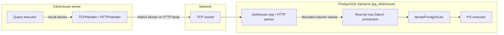

# Result Transport — ClickHouse to Remote pg_auto_click Sink

This spec pins the phase-1 transport for query results flowing from a ClickHouse server back to the remote pg_auto_click sink. It is a sibling of the source-direction SHM specs but is architecturally independent of them: the result direction reuses ClickHouse's existing client protocols verbatim and introduces no new wire contract in phase 1.

System mission, glossary, non-goals, cross-component invariants, and end-to-end acceptance criteria for the SHM source feature live in [system spec](./system-spec.md). The ingestion-direction wire lives in [shm-block-stream spec](./shm-block-stream-spec.md). The two directions do not share infrastructure in phase 1.

## Mission

Define the transport used by the remote pg_auto_click sink (the `pg_clickhouse` FDW running inside a PostgreSQL backend process) to receive ClickHouse query results in phase 1:

- ClickHouse executes queries pushed down from PostgreSQL via the `pg_clickhouse` FDW and returns results over its existing client-facing protocols — **Native (binary)** or **HTTP** — with no new wire contract introduced for the result direction.
- The sink decodes incoming result blocks into PostgreSQL `Datum` values and feeds them to the PG executor one tuple at a time via the standard FDW `IterateForeignScan` callback.
- The binding contract for these transports is already owned by ClickHouse's Native protocol spec and HTTP interface documentation; this spec does not duplicate or extend those contracts. It records which transports phase 1 uses, what properties are inherited, and where the per-protocol result path hands off to PG.

## Scope

**In scope:**

- Which CH client transports are used in phase 1 and their configuration surface within `pg_clickhouse`.
- The result-path data flow from CH executor to PG FDW handler, including per-driver decode and row-build.
- The failure model inherited from the existing transports (error frames, connection loss, query cancellation).
- A forward-looking note on a future SHM result driver as an optimization (no contract pinned).

**Out of scope:**

- Any modification to ClickHouse's Native protocol (`TCPHandler`) or HTTP interface (`HTTPHandler`). Phase 1 does not touch either.
- Zero-copy transfer of result bytes between CH and the PG backend. The co-located SHM optimization is deferred; see [Future work — SHM result driver](#future-work--shm-result-driver) below.
- The PG-side reader implementation beyond the FDW contract boundary. The `pg_clickhouse` FDW is satisfied by an external implementation; this spec pins the wire boundary and the inherited properties, not the PG-side code.
- Any change to [system spec N2](./system-spec.md#non-goals) ("No ClickHouse-writes-to-SHM"). Phase 1 fully honors N2.

## Transports

Two drivers are available in phase 1. Both are already implemented and operated by `pg_clickhouse`. The choice is a `CREATE SERVER` option; no CH-side configuration change is required.

### Native (binary) driver

- **Protocol.** ClickHouse Native TCP protocol, served by `TCPHandler`. Implemented client-side via [`clickhouse-cpp`](https://github.com/ClickHouse/clickhouse-cpp).
- **Default ports.** 9440 (TLS, ClickHouse Cloud), 9004 (non-TLS, self-hosted).
- **Result encoding.** Column-oriented blocks of typed values. `clickhouse-cpp` decodes each block into C++ column types; `pg_clickhouse` then iterates the block row-by-row, converting each value to a PG `Datum` and building a `HeapTuple` for the FDW.
- **Streaming.** The Native protocol delivers blocks incrementally as CH produces them. `pg_clickhouse` processes each decoded block before requesting the next, so memory consumption inside PG is bounded by the size of one block at a time.
- **Cancellation.** Standard CH query cancel over the TCP connection. The FDW tears down the `clickhouse-cpp` connection on PG executor cancellation; the CH server observes the cancellation and terminates the query.
- **Configuration surface in `pg_clickhouse`.**
  ```sql
  CREATE SERVER ch_srv FOREIGN DATA WRAPPER clickhouse_fdw
      OPTIONS(driver 'binary', host '...', dbname '...');
  ```

### HTTP driver

- **Protocol.** ClickHouse HTTP interface, served by `HTTPHandler`. Default format is a tabular text format (TSV-based) with fixed settings: `date_time_output_format = 'iso'`, default `format_tsv_null_representation`, default `output_format_tsv_crlf_end_of_line`.
- **Default ports.** 8443 (TLS, ClickHouse Cloud), 8123 (non-TLS, self-hosted).
- **Result encoding.** A single HTTP response body parsed row-by-row. `pg_clickhouse` converts each parsed row to a PG `Datum` array and builds a `HeapTuple`.
- **Streaming (since pg_clickhouse v0.1.10).** The HTTP response body is consumed incrementally. The `fetch_size` server/table option (default `50000000`, 50 MB) caps the in-flight byte budget; batch boundaries are on row boundaries. Setting `fetch_size = 0` disables streaming and buffers the full response in PG memory before the first tuple is returned — avoid for large result sets.
- **Cancellation.** Closing the HTTP connection causes CH to cancel the running query on the next write attempt. The FDW closes the connection on PG executor cancellation.
- **Configuration surface in `pg_clickhouse`.**
  ```sql
  CREATE SERVER ch_srv FOREIGN DATA WRAPPER clickhouse_fdw
      OPTIONS(driver 'http', host '...', dbname '...', fetch_size '50000000');
  ```

## End-to-end result flow



Contrast with the **ingestion direction** (right-to-left in the system spec component map): the PG-side producer writes column data into SHM blocks; CH reads them zero-copy via the pollable SHM source. The result direction is entirely independent: it does not involve SHM, does not involve the adoption layer, and does not involve the memory-tracker integration defined in the source-direction specs.

## Phase-1 properties (delegated to existing transports)

The result direction inherits the following properties from ClickHouse's existing client-transport guarantees without additional spec on this side:

| Property | Native driver | HTTP driver |
|---|---|---|
| **Back-pressure** | TCP flow control on the connection socket | HTTP response body buffer fill; `fetch_size` caps PG-side working set |
| **Cancellation** | Standard CH cancel frame over TCP; CH terminates query on cancel receipt | HTTP connection close; CH terminates on next write attempt |
| **Server-side memory / size limits** | `max_result_bytes`, `max_result_rows` CH settings enforced before wire | Same |
| **Failure surfacing** | Error frame decoded by `clickhouse-cpp`; translated to PG `ereport()` | HTTP error body parsed by FDW; translated to PG `ereport()` |
| **TLS** | Supported on both drivers via standard ClickHouse TLS configuration | Supported on both drivers via standard ClickHouse TLS configuration |

No new invariants or acceptance criteria are defined at this layer in phase 1. The binding contracts for these properties live in ClickHouse's [Native protocol documentation](https://clickhouse.com/docs/native-protocol/basics) and [HTTP interface documentation](https://clickhouse.com/docs/interfaces/http).

## Relationship to source-direction specs

The ingestion (SHM source) and result (Native/HTTP) directions are independent at every layer in phase 1.

| Dimension | Ingestion direction (SHM source) | Result direction (this spec) |
|---|---|---|
| **Wire** | SHM block-stream v1 ABI ([shm-block-stream-spec.md](./shm-block-stream-spec.md)) | CH Native TCP or CH HTTP (existing protocols) |
| **CH-side component** | Pollable SHM source (`IProcessor`) | Standard `TCPHandler` / `HTTPHandler` |
| **PG-side component** | External SHM producer (out of spec scope) | `pg_clickhouse` FDW — `clickhouse-cpp` or HTTP parser |
| **Memory model** | Zero-copy adoption; charge tracked via `MemoryTracker` integration | Copy into PG-allocated `HeapTuple` memory; no SHM |
| **Shared infrastructure** | None | None |

## Future work — SHM result driver

A future optimization could add a `driver 'shm'` to `pg_clickhouse` for the co-located case (CH and PG on the same host). Under this scheme, the CH server would publish query-result `Chunk`s into SHM blocks using the existing v1 column-oriented ABI defined in [shm-block-stream-spec.md](./shm-block-stream-spec.md), and the PG-side reader would adopt them zero-copy — mirroring the existing ingestion-direction path in reverse. This would renegotiate [system spec N2](./system-spec.md#non-goals) (which currently forbids ClickHouse-writes-to-SHM) and is explicitly out of phase 1; no contract for it is pinned here.
